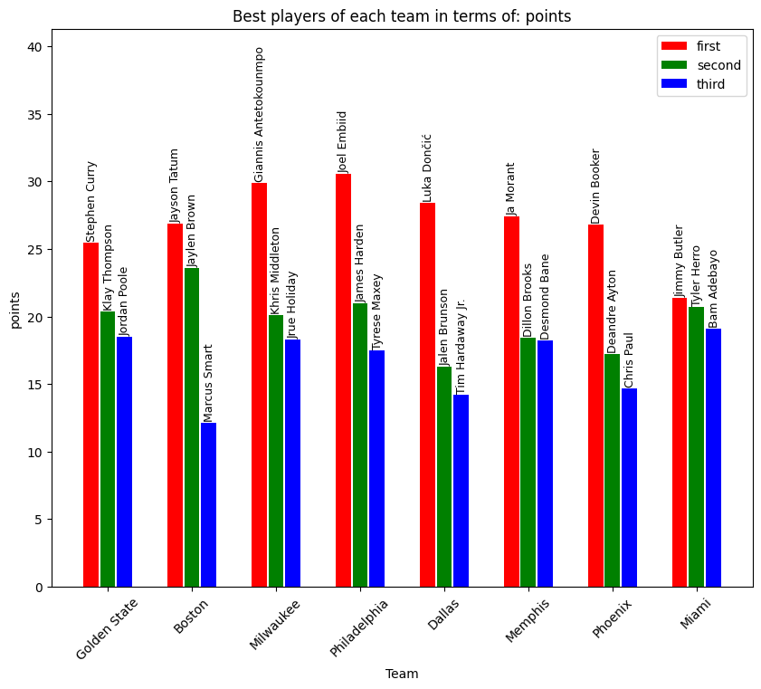
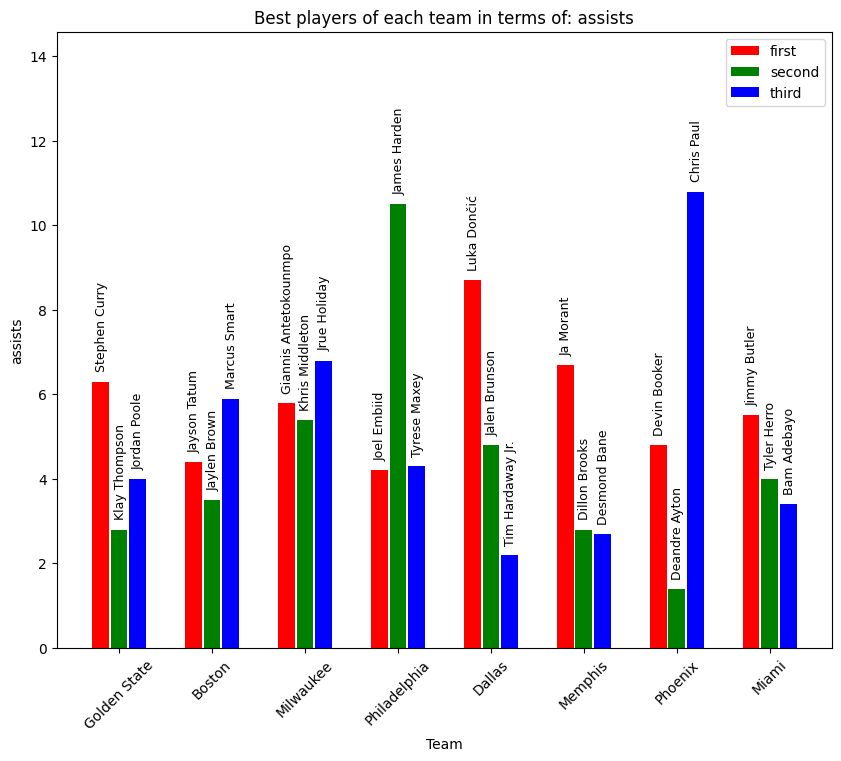
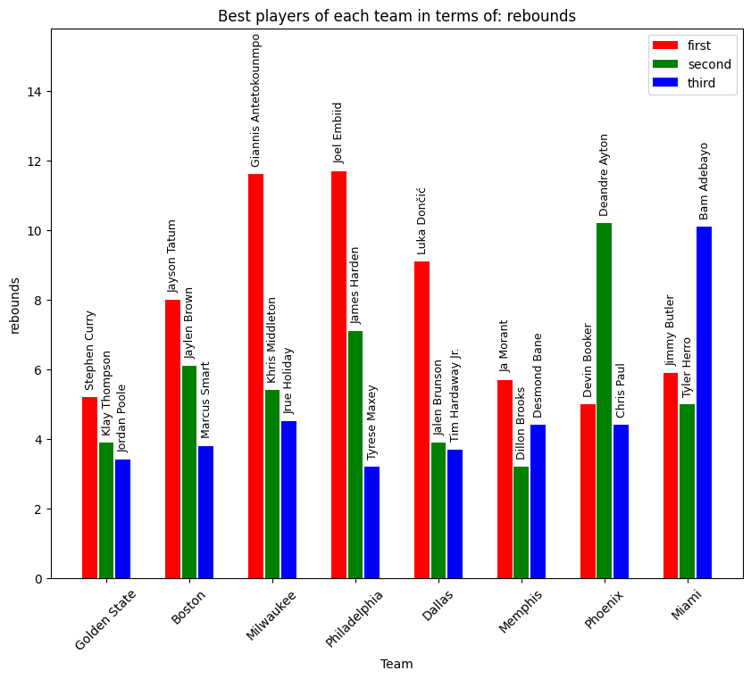

# `Web Scraping and "Wikipedia Golf"`
---

## Summary of Content
---
The content of the scripts in this directory can be divided into two:


 * *Web Scraping with regular expressions*:
   Scripts which can be used to download the `HTML`string of a given URL, extract all URLs from that HTML. There is also support for specifically extract all Wikipedia article URLs from a given `HTML` string. On these we build a tool that given two Wikipedia articles, start and finish, tries to find the shortest "path" between these by "clicking" on the least amount of hyperlinks in total. Henceforth this is refered to as "Wikipedia Golf" in this documentation. Also included is a function that uses regular expressions to collect all dates (in *year/month/day* format) from an HTML string.

* *Web Scraping with Beautiful Soup*: 
  Scripts which use the Beautiful Soup to parse HTML strings and extract useful data. In this case the scripts are made to parse HTML text of Wikipedia articles about different NBA teams/players and collect these in some summary figures that rank the best three players of each team under three different statistics.

---
## Requirements and Dependencies
---
Before installing any dependencies for running the provided codes we recommend that first a new `conda` environment is made. An environment can be created and activated by running 
> `$ conda create --name <name of my environment> python=3.10`

> `$ conda activate <name of my environment>`

Once inside the activated environment we can continue to install any of the needed requirements. The code requires a `python >= 3.7`. The package requirements include;

 * `numpy 1.23.3`
 * `beautifulsoup4 4.11.1`
 * `requests 2.28.1`
 * `pandas 1.5.0`
 * `tabulate 0.9.0`
 * `matplotlib 3.6.1`
 * `cycler 0.11.0`
 * `pytest 7.1.3`

These packages can, once in the created `conda` environment, simply be installed by running 
> `$ python3 -m pip install <package name>==<package version>`
where the `<package name>` and `<package version>` are any of the above specified package names and versions.

There are also several `python` standard library packages that are needed, but these should come installed with any `python` installation. Most notable among these are;

 * `re` - For regular expressions.
 * `multiprocessing` - For parallelized keyword search in "Wikipedia Golf" routine.
 * `random` - Needed for randomly picking a URL if stuck in "Wikipedia Golf".
 
**NOTE** that the code was developed on a machine with `macOS Monterey 12.6`. However, the code should run on any `Unix` or `Windows` system as long as a new environment (so there are no dependency conflicts) is made and the requirements of the dependencies are fulfilled.

---
## Usage
---
In the following we will give a rough overview of the scripts and their main functional content. NOTE that we may not describe all helper functions, so if interested in these please look at the doc-strings and comments in said helpers.

The scripts provided in this directory are;
* `request_url.py` which contains a function `get_html`.

    *Usage example in python script:*

    Given some URL, e.g.
    > `url = "https://en.wikipedia.org/wiki/Norway"`

    We can download the corresponding HTML page as a string `html` by
    > `html = get_html(url)`

    We can also pass key-value pairs to request the `HTML` of a URL on the form
    `https://en.wikipedia.org/w/index.php?title=Main_Page`, where we have a key `title` and 
    value `Main_Page` which we can request using the `?` after the URL proper. 
    Such a key-value pair can be passes to `get_url` as a dictionary;
    > `url = "https://en.wikipedia.org/w/index.php"`
    > `params = {"title": "Main_Page"}`
    > `html = get_html(url, params, "output.txt")`
    Note that we in the last call to `get_html` also provide the string `"output.txt"`, which will save the downloaded `HTML` to a file called `"output.txt"`.

* `find_urls.py` which contains the functions `find_urls` and `find_articles`.
  
    *Usage example in python script:*

    Given a `HTML` string, that we for instance can get using the `get_html` function specified earlier, we can extract all URLs that are contained in the HTML string by using the `find_urls`;
    > `set_of_urls = get_urls(html)`

    And similarly, we can extract all valid Wikipedia article URLs from a given Wikipedia HTML text. It is used in a similar way as `get_urls`;
    > `set_of_wiki_articles = get_urls(wiki_html)`
    Both of these functions return sets of URL strings.

* `collect_dates.py` which contains the function `find_dates`.
  
    *Usage example in python script:*
    
    Given a `HTML` string we may want to extract all dates from the string. This can be done using the `find_dates` which will find all dates on the formats `DMY`, `MDY`, `YMD` and `ISO` and return the date on the form `year/month/day`. We can call the function given a string of HTML, `html`, by

    > `dates_list = find_dates(html, "outfile.txt")`

    where we also passed a name to a file in which the found dates will be saved; `"outfile.txt"`.

* `time_planner.py` which contains the functions `extract_events` and `time_plan`. 
    
    *Usage example in python script:*
    
    Given a `bs4.element.Tag` for e.g. the Calendar table at ` https://en.wikipedia.org/wiki/2022–23_FIS_Alpine_Ski_World_Cup` we can extract all the event dates, venues and event types from the table using the `extract_event` function
    > `table_data = extract_events(my_bs4_table_tag)`

    where `table_data` is a `pandas` data frame.
    The extracted data frame can then be visualized in a markdown string using the `time_plan` function
    > `url = "https://en.wikipedia.org/wiki/2022–23_FIS_Alpine_Ski_World_Cup"`
    
    > `markdown = time_plan(url)`
    
    > `print(markdown)`  

* `fetch_player_statistics.py` which contains the function `get_teams`, `get_players`, `get_player_stats` and `find_best_players`. 
    
    *Usage example in python script:*

    Given the URL `"https://en.wikipedia.org/wiki/2022_NBA_playoffs"` to the NBA 2022 play-off the `get_teams` function will return a list of dictionaries on the form `[..., {"name": "some_team_name", "url": "https://wikipedia.org/wiki/some_team}, ...]`. It is simply called by 
    > `team_list = get_teams("https://en.wikipedia.org/wiki/2022_NBA_playoffs")`

    Given the URL, `team_url`, to a Wikipedia article about some NBA team the `get_players` function will extract the names and URLs to all team's players Wikipedia pages. It can be used by e.g.

    > `team_url = "https://en.wikipedia.org/wiki/2021%E2%80%9322_Golden_State_Warriors_season"`

    > `players_list = get_players(team_url)`

    Where the returned list of players will be a list of player dictionaries on the form;    
    `[..., {'name': 'Curry, Stephen', 'url': 'https://en.wikipedia.org/wiki/Stephen_Curry'}, ...]`.

    From the found URLs of some player we can then extract the corresponding `points`, `assists` and `rebounds` statistics of that player by

    > `player_stats = get_player_stats("https://en.wikipedia.org/wiki/Stephen_Curry", "Golden State")`

    where we provide both the link and team name of the player. That is since we only want to get the statistics of the player from the 2021-2022 season and some players changed teams during that season. The returned dictionary will then be on the form `{'rebounds': 5.2, 'assists': 6.3, 'steals': 1.3, 'blocks': 0.4, 'points': 25.5}`.

    To get a quantitative overview of all best players statistics we can then calls the `find_best_players` which will call all the above functions and find the best three players of all teams in terms of the `points` statistic and then plot a bar plot for each of the three statistics. The plots will be saved to file in the `NBA_player_statistics/` subdirectory. We can call this function by simply running 

    > `url = "https://en.wikipedia.org/wiki/2022_NBA_playoffs"`
    
    > `find_best_players(url)`
    
    which should result in the following three plots saved to file;

     
     
     

* `wiki_race_challenge.py` which contains the `find_path` function. 
    
    *Usage example in python script:*

    Given a `start` and `finish` URL the `find_path` function will try to find
    the shortest path of URLs from the `start` to `finish` Wikipedia articles. It will then return a list of URLs, `paths_taken`, taken during the game of "Wikipedia Golf";

    > `start = "https://en.wikipedia.org/wiki/Python_(programming_language)"`
    
    > `finish = "https://en.wikipedia.org/wiki/Peace"`

    > `paths_taken = find_path(start, finish)`

    While running it will print some informative text on where it is currently and how many "steps" have been taken. In some cases the number of steps taken is as low as 2-3 and in other cases it needs < 200 steps, depending on the start and finish topics.

    *If you want to chose different start/finish paths then change the `start` and/or `finish` paths inside the mail-block of `wiki_race_challenge.py` as we have not yet implemented a command line interface for this script*

    The basic strategy idea is 
    1) That we extract the title keyword from the finish article.
    2) Check in the `start` URL's HTML text if it contains the `finish` URL and stop if yes. 
    3) If not we continue and extract all Wikipedia article URLs from the current URL (`start` at the beginning) and then check and count matches of the keyword in each article (this is done parallelized).
    4) The URL with the most matches is then chosen and used as the new current URL. If no match is found a random URL is chosen.
    5) Continue until arriving at `finish`. 

## Comment on runnable codes
All scripts provided can be imported and used inside a python script (once inside `assignment4` directory as it is not `pip` installable yet). Otherwise some scripts like `wiki_race_challenge.py`, `fetch_player_statistics.py` and `time_planner.py` have main-blocks with run examples that can be run as a regular python script:
> e.g. `python wiki_race_challenge.py`. 


---
## Tests
In order to run the unit tests on the provided routines we need to use `pytest`. 

To check if our installation of the package was successfully we can run:

`$  pytest -vv tests`

```
======================================== test session starts ========================================
platform darwin -- Python 3.10.4, pytest-7.1.3, pluggy-1.0.0 -- /opt/homebrew/Caskroom/miniconda/base/envs/in4110/bin/python
cachedir: .pytest_cache
rootdir: /Users/nilsoles/Documents/IN3110-nilsoles/assignment4
plugins: anyio-3.6.1
collected 37 items

tests/test_collect_dates.py::test_find_dates[DMY: 2 January 2020-2020/01/02] PASSED           [  2%]
tests/test_collect_dates.py::test_find_dates[MDY: February 12, 1954-1954/02/12] PASSED        [  5%]
tests/test_collect_dates.py::test_find_dates[YMD: 2015 March 31-2015/03/31] PASSED            [  8%]
tests/test_collect_dates.py::test_find_dates[ISO: 2022-04-15-2022/04/15] PASSED               [ 10%]
tests/test_collect_dates.py::test_find_dates[DMY: 22 June 2020-2020/06/22] PASSED             [ 13%]
tests/test_collect_dates.py::test_find_dates[MDY: October 13, 2025-2025/10/13] PASSED         [ 16%]
tests/test_collect_dates.py::test_find_dates[YMD: 2019 December 2-2019/12/02] PASSED          [ 18%]
tests/test_collect_dates.py::test_find_urls[https://en.wikipedia.org/wiki/Serena_Williams-expected0] PASSED [ 21%]
tests/test_collect_dates.py::test_find_urls[https://en.wikipedia.org/wiki/Marie_Curie-expected1] PASSED [ 24%]
tests/test_collect_dates.py::test_find_urls[https://en.wikipedia.org/wiki/Hans_Petter_Langtangen-expected2] PASSED [ 27%]
tests/test_fetch_player_statistics.py::test_get_teams PASSED                                  [ 29%]
tests/test_fetch_player_statistics.py::test_get_players[https://en.wikipedia.org/wiki/2021%E2%80%9322_Golden_State_Warriors_season-17-expected_players0] PASSED [ 32%]
tests/test_fetch_player_statistics.py::test_get_players[https://en.wikipedia.org/wiki/2021%E2%80%9322_Philadelphia_76ers_season-17-expected_players1] PASSED [ 35%]
tests/test_fetch_player_statistics.py::test_get_player_stats[https://en.wikipedia.org/wiki/Giannis_Antetokounmpo-Milwaukee-stats0] PASSED [ 37%]
tests/test_fetch_player_statistics.py::test_find_best_players PASSED                          [ 40%]
tests/test_files.py::test_location PASSED                                                     [ 43%]
tests/test_files.py::test_files_exist[README.md] PASSED                                       [ 45%]
tests/test_files.py::test_files_exist[requesting_urls.py] PASSED                              [ 48%]
tests/test_files.py::test_files_exist[filter_urls.py] PASSED                                  [ 51%]
tests/test_files.py::test_files_exist[collect_dates.py] PASSED                                [ 54%]
tests/test_files.py::test_files_exist[time_planner.py] PASSED                                 [ 56%]
tests/test_filter_urls.py::test_find_urls PASSED                                              [ 59%]
tests/test_filter_urls.py::test_find_urls_pages[https://en.wikipedia.org/wiki/Nobel_Prize-links0] PASSED [ 62%]
tests/test_filter_urls.py::test_find_urls_pages[https://en.wikipedia.org/wiki/Bundesliga-links1] PASSED [ 64%]
tests/test_filter_urls.py::test_find_urls_pages[https://en.wikipedia.org/wiki/2019%E2%80%9320_FIS_Alpine_Ski_World_Cup-links2] PASSED [ 67%]
tests/test_filter_urls.py::test_find_articles[https://en.wikipedia.org/wiki/Nobel_Prize-expected0] PASSED [ 70%]
tests/test_filter_urls.py::test_find_articles[https://en.wikipedia.org/wiki/Bundesliga-expected1] PASSED [ 72%]
tests/test_filter_urls.py::test_find_articles[https://en.wikipedia.org/wiki/2019%E2%80%9320_FIS_Alpine_Ski_World_Cup-expected2] PASSED [ 75%]
tests/test_requesting_urls.py::test_get_html_no_params[https://en.wikipedia.org/wiki/Studio_Ghibli-Studio Ghibli] PASSED [ 78%]
tests/test_requesting_urls.py::test_get_html_no_params[https://en.wikipedia.org/wiki/Star_Wars-Star Wars] PASSED [ 81%]
tests/test_requesting_urls.py::test_get_html_no_params[https://en.wikipedia.org/wiki/Dungeons_%26_Dragons-Dungeons] PASSED [ 83%]
tests/test_requesting_urls.py::test_get_html_params[params0-<title>Wikipedia] PASSED          [ 86%]
tests/test_requesting_urls.py::test_get_html_params[params1-<title>Hurricane] PASSED          [ 89%]
tests/test_requesting_urls.py::test_get_html_output PASSED                                    [ 91%]
tests/test_time_planner.py::test_extract_events PASSED                                        [ 94%]
tests/test_time_planner.py::test_render_schedule PASSED                                       [ 97%]
tests/test_time_planner.py::test_time_plan[2022-23] PASSED                                    [100%]

======================================== 37 passed in 32.75s ========================================
```